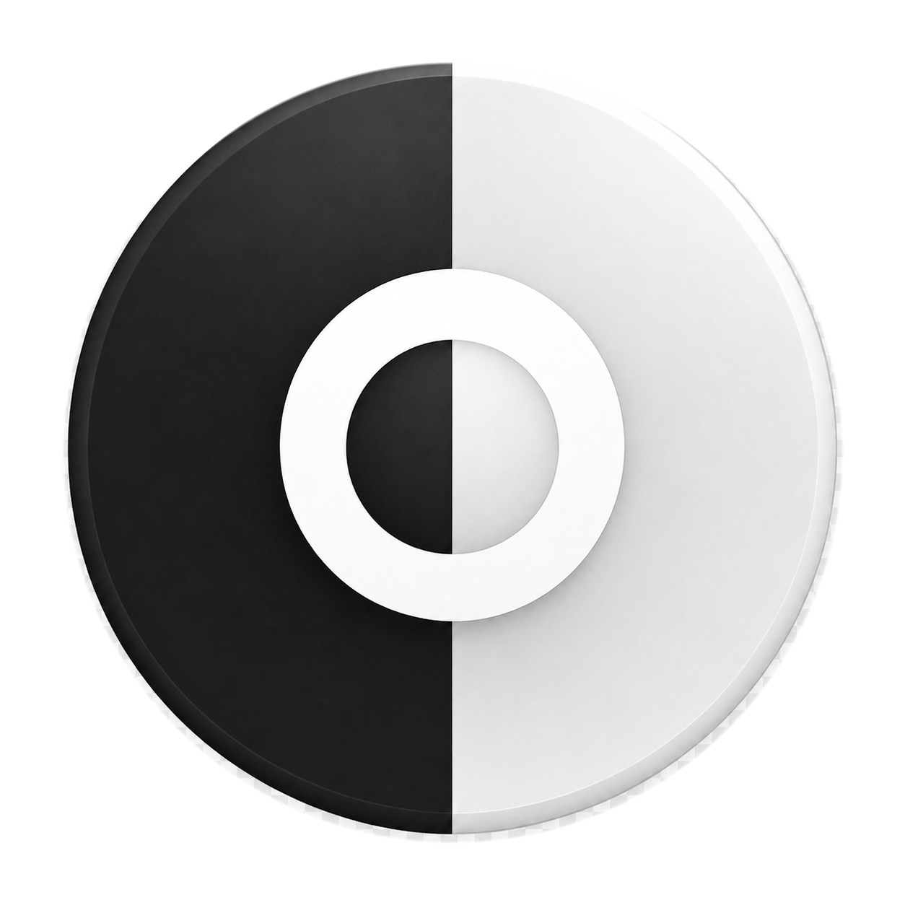

# Lightswitch

Lightswitch is a tiny, portable Windows utility for switching the system and app appearance between light and dark mode.



## Features

- One-click light/dark mode switching
- Compact native Windows interface
- Automatically follows the Windows display language
- No installation, background service, telemetry, or administrator rights
- Single portable executable

## Download

Download `Lightswitch.exe` from the latest GitHub release and run it. Windows may show a SmartScreen warning because the executable is not code-signed.

## How it works

Lightswitch updates these per-user Windows appearance preferences:

```text
HKEY_CURRENT_USER\Software\Microsoft\Windows\CurrentVersion\Themes\Personalize
AppsUseLightTheme
SystemUsesLightTheme
```

It then broadcasts a standard settings-change notification so compatible applications update immediately. Lightswitch does not interact with Windows activation, product keys, licensing files, or licensing services. Users remain responsible for running a properly licensed copy of Windows.

## Supported languages

English, German, French, Spanish, Italian, Portuguese, Dutch, Polish, Russian, Japanese, Korean, Simplified Chinese, Traditional Chinese, and Turkish. Unsupported display languages fall back to English.

## Build

The application is implemented with the Win32 API and has no third-party runtime dependencies.

### Visual Studio Developer Command Prompt

```bat
powershell -ExecutionPolicy Bypass -File build.ps1
```

The resulting executable is written to `build\Lightswitch.exe`.

## Compatibility

Windows 10 and Windows 11, 64-bit.

## License

[MIT](LICENSE)
